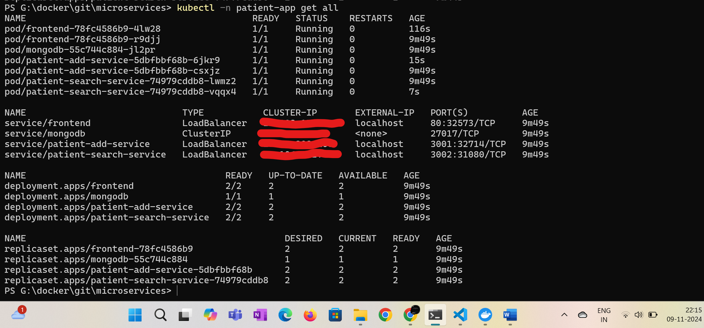

# microservices

# Cloud computing sample web application using Microservices architecture, Kubernetes and Docker

### Pre-requsites:
- **Docker Hub for desktop**
- **Kubernetes**
- **Docker**

### Docker image build and push into repo:
```bash
docker login (optional)
$env:DOCKER_USERNAME = "DOCKER_USERNAME"
docker-compose build
docker-compose push
```

### K8S commands to run the application
```bash
kubectl apply -f ./k8s-deployment.yaml
kubectl -n patient-app get all
```

### Scaling up of the applications
```bash
kubectl -n patient-app scale deploy frontend --replicas=2
kubectl -n patient-app scale deploy patient-add-service --replicas=2
kubectl -n patient-app scale deploy patient-search-service --replicas=2
```

### Scaling down of the applications
```bash
kubectl -n patient-app scale deploy frontend --replicas=1
kubectl -n patient-app scale deploy patient-add-service --replicas=1
kubectl -n patient-app scale deploy patient-search-service --replicas=1
```

### Open front end app here: http://localhost:80

### Sample application home page:


### Sample application add patient:


### Sample application search patinet:


### Sample application K8S deployment overview:


### Sample application K8S deployment overview after scalling:


### To delete the deployment
```bash
kubectl delete -f ./k8s-deployment.yaml
```

### Docker compose commands manual pushinto repo (Optional):
```bash
docker-compose up --build (optional)

cd ./frontend
docker build -t assignment1-frontend:latest .
docker tag assignment1-frontend:latest DOCKER_USERNAME/assignment1-frontend:latest
docker push  DOCKER_USERNAME/assignment1-frontend:latest

cd ./patient-add-service
docker build -t assignment1-patient-add-service:latest .
docker tag assignment1-patient-add-service:latest DOCKER_USERNAME/assignment1-patient-add-service:latest
docker push  DOCKER_USERNAME/assignment1-patient-add-service:latest

cd ./patient-search-service
docker build -t assignment1-patient-search-service:latest .
docker tag assignment1-patient-search-service:latest DOCKER_USERNAME/assignment1-patient-search-service:latest
docker push  DOCKER_USERNAME/assignment1-patient-search-service:latest
```

### DEBUG commands from inside pod/container:
```bash
kubectl apply -f .\k8s-deployment.yaml --dry-run -o yaml
kubectl -n patient-app exec -it <frontend-end-pod> /bin/sh

curl -X POST http://patient-add-service:3001/patients/add \
-H "Content-Type: application/json" \
-d '{"name": "John Doe", "age": 30, "address": "123 Main St"}'

curl "http://patient-search-service:3002/patients/search?name=John%20Doe"
 
curl -X POST http://patient-add-service.patient-app.svc.cluster.local:3001/patients/add \
-H "Content-Type: application/json" \
-d '{"name": "John Doe", "age": 30, "address": "123 Main St"}'

curl "http://patient-add-service.patient-app.svc.cluster.local:3002/patients/search?name=John%20Doe"
```